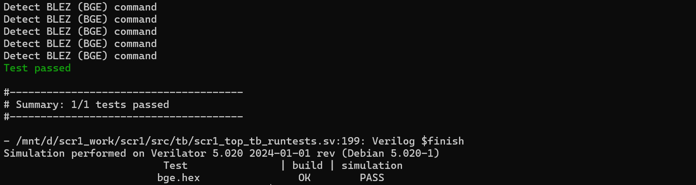
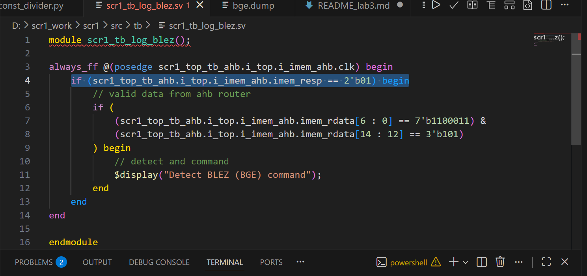
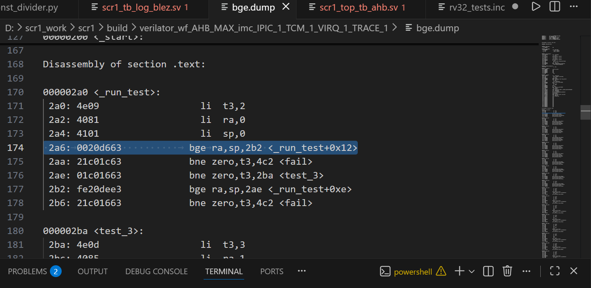
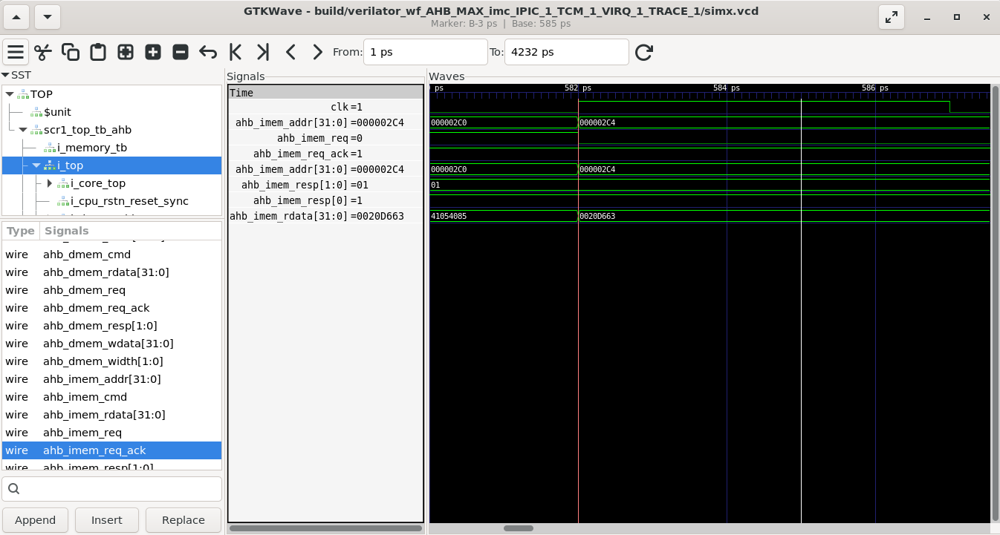

# ITMO SoC – Лабораторная работа №3 (конвейер SCR1, BLEZ)

## Цель работы

В данной работе проводится анализ работы конвейера ядра SCR1 с использованием симулятора Verilator и программы GTKWave. Основное внимание уделяется псевдо‑команде BLEZ, которая реализована как реальная команда RISC‑V BGE (ветвление при `rs1 >= rs2`).  
Цель – связать представление команды на уровне ISA (машинный код) с её прохождением через стадии выборки и исполнения в процессоре и подтвердить это с помощью временных диаграмм и логов симуляции.  

## Среда выполнения

- Ubuntu / WSL под Windows.  
- Ядро SCR1 из репозитория Syntacore, рабочая ветка: `lab3scr1pipeanalys`.  
- Verilator 4.0 для симуляции RTL‑описания.  
- RISC‑V GNU toolchain (riscv64‑unknown‑elf‑gcc).  
- GTKWave для просмотра файлов VCD (`simx.vcd`).  

## Основные шаги

1. Клонирование SCR1 и подготовка ветки:  
   - Создан рабочий каталог на диске D: `D:\scr1_work\scr1`.  
   - Выполнены команды `git checkout master` и `git checkout -b lab3scr1pipeanalys`.  
   - Инициализированы подмодули (riscv‑tests, coremark и др.) с помощью `git submodule update --init --recursive`.  

2. Сборка и запуск симуляции с трассировкой:  
   - В переменную PATH добавлен путь к инструментам RISC‑V.  
   - Выполнены команды:  
     - `make clean`  
     - `make run_verilator_wf TARGETS=riscv_isa TRACE=1`  
   - На первом этапе успешно прошли все тесты RISC‑V ISA.  

3. Выбор команды лабораторного задания и сокращение набора тестов:  
   - Согласно условиям, заданию №7 соответствует псевдо‑команда BLEZ, реализованная через команду BGE.  
   - Конфигурация набора тестов `riscv_isa` изменена таким образом, что остаётся только один тест – `bge.hex`. В отчёте симуляции получено `Summary: 1/1 tests passed` для теста `bge.hex`.  
    

4. Добавление модуля для обнаружения команды BLEZ (BGE):  
   - Создан новый файл тестового окружения `src/tb/scr1_tb_log_blez.sv`.  
   - Модуль наблюдает за данными с интерфейса памяти инструкций (`imem_rdata` / `ahb_imem_rdata`) при валидном ответе (`imem_resp = 2'b01`).  
   - Проводится побитная проверка:  
     - `imem_rdata[6:0]   = 7'b1100011`  – opcode группы branch.  
     - `imem_rdata[14:12] = 3'b101`      – поле func3 команды BGE.  
   - При выполнении условия модуль выводит в лог симуляции сообщение:  
     `Detect BLEZ (BGE) command`, тем самым фиксируя прохождение целевой команды через конвейер.  
   - В файл `src/tb/scr1_top_tb_ahb.sv` добавлен инстанс:  
     `scr1_tb_log_blez u_scr1_tb_log_blez();`.  

        
    
5. Анализ временных диаграмм в GTKWave:  
   - Открыт файл `simx.vcd` из каталога  
     `build/verilator_wf_AHB_MAX_imc_IPIC_1_TCM_1_VIRQ_1_TRACE_1/`.  
   - В GTKWave выбраны и проанализированы следующие сигналы:  
     - `clk` – тактовый сигнал.  
     - `curr_pc` (или эквивалентный сигнал счётчика команд на стадии Execution).  
     - Сигналы интерфейса выборки инструкций (AHB):  
       - `ahb_imem_req` – запрос процессора к памяти инструкций;  
       - `ahb_imem_addr` – адрес выбираемой инструкции;  
       - `ahb_imem_resp` – ответ памяти, значение `01` соответствует валидному слову;  
       - `ahb_imem_rdata` – считанное слово инструкции.  
   - Связаны три уровня представления команды BGE:  
     - disassembly в файле `bge.dump`, где, например, по адресу `0x000002a6` находится команда  

        

       `bge ra, sp, 2b2` с машинным кодом `0x0020D663`;  
     - временная диаграмма GTKWave, где в тот же момент времени наблюдается  
       `ahb_imem_resp = 01` и `ahb_imem_rdata = 0x0020D663`;  
     - сообщение `Detect BLEZ (BGE) command` в тексте симуляции.  
        

6. Результаты

- Модуль `scr1_tb_log_blez` корректно обнаруживает моменты прохождения команды BGE, соответствующей лабораторной команде BLEZ.  
- В финальном отчёте симуляции отображается:  
  - множественный вывод `Detect BLEZ (BGE) command`;  
  - статус теста `bge.hex: build = OK, simulation = PASS`;  
  - итог `Summary: 1/1 tests passed`.  

## Важные файлы ветки

- `src/tb/scr1_tb_log_blez.sv` – модуль тестового окружения, реализующий логирование и обнаружение команды BLEZ (BGE).  

- `sim/tests/riscv_isa/Makefile` – изменённый список тестов, оставлен только `bge`.  
- `build/.../bge.dump` – дизассемблирование тестовой программы, использованное для сопоставления машинного кода и диаграмм.  
- Скриншоты (GTKWave, disassembly, лог симуляции), подтверждающие обнаружение команды и работу конвейера для выбранного теста.  

---