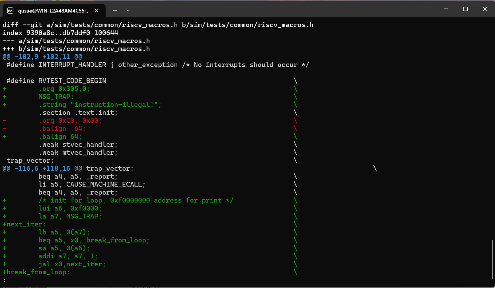
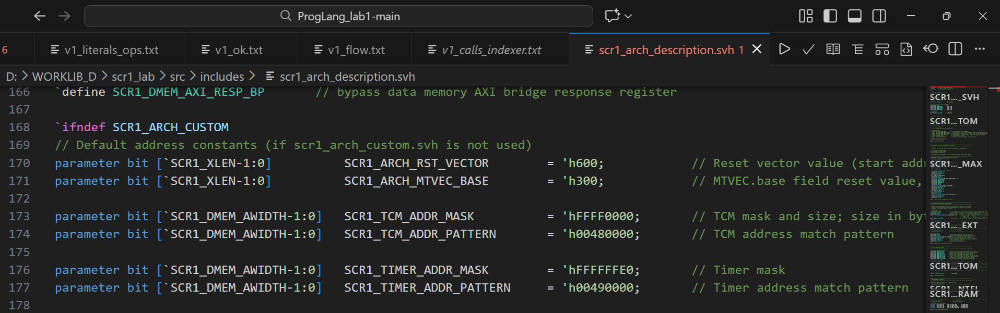
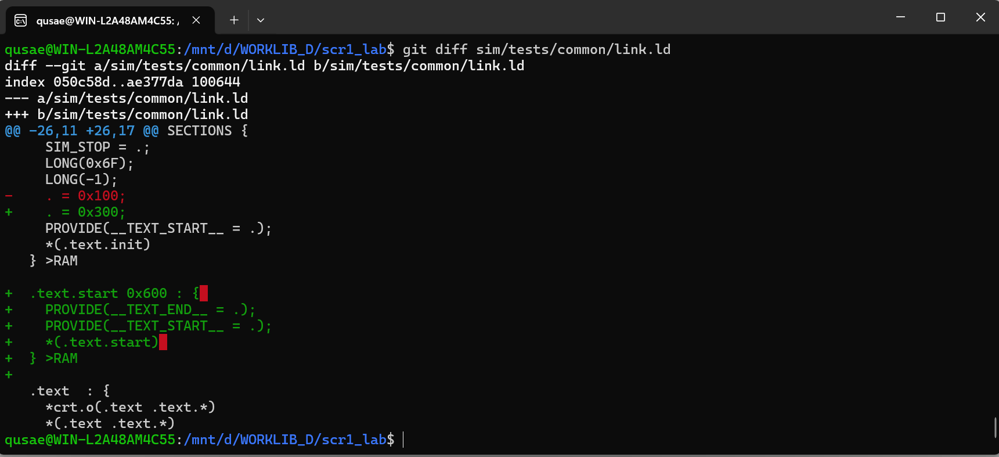
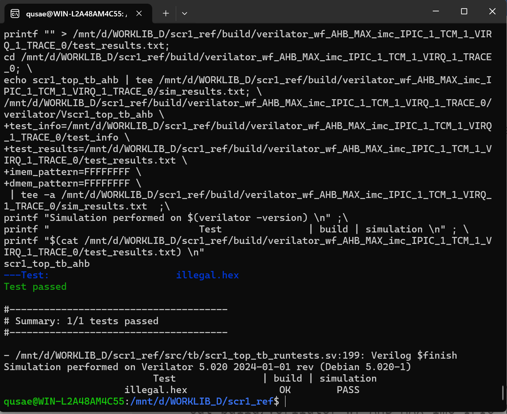
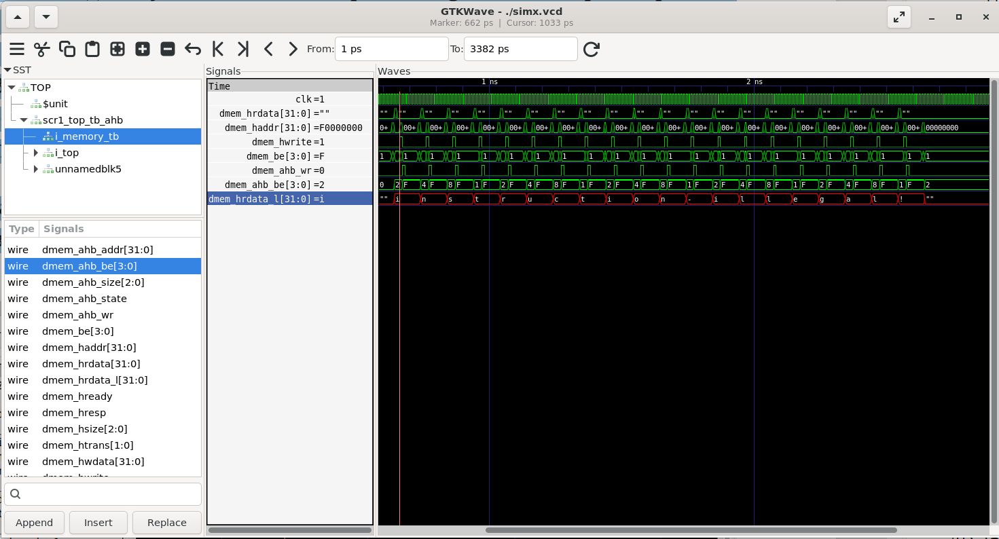

# Лабораторная работа №2 (SCR1): Exceptions/Reset/Trap Vector/Linker/Simulation

## Цель
Ознакомиться с настройкой архитектурных параметров ядра SCR1 (Reset Vector/Trap Vector), обработкой исключений/прерываний и влиянием linker-скрипта на размещение кода в памяти.

## Вариант
- Вариант: 7
- Тип исключения: Illegal instruction
- Тест: `isa/rv32mi/illegal.S`
- Reset Vector: `0x600`
- Trap Vector: `0x300`
- Требуемая строка: `instruction-illegal`

## Выбор теста
В списке тестов оставлен только тест по варианту `illegal` (rv32mi/illegal.S), чтобы в симуляции выполнялся один тест.

## Модификация trap handler (riscv_macros.h)
Файл: `sim/tests/common/riscv_macros.h`.

Была модифицирована обработка исключений (trap_vector) согласно варианту:
- добавлена строка `instruction-illegal` (как `MSG_TRAP`);
- реализован цикл посимвольной печати (запись символов по адресу вывода тестового окружения);
- после обработки исключения выполнена корректировка `mepc` (чтобы не зациклиться на illegal-инструкции) и выполнен возврат `mret`.

## Настройка Reset Vector и Trap Vector (scr1_arch_description.svh)
Файл: `src/includes/scr1_arch_description.svh`.

Параметры ядра выставлены согласно варианту:
- `SCR1_ARCH_RST_VECTOR = 0x600`
- `SCR1_ARCH_MTVEC_BASE = 0x300`

## Изменение linker-скрипта (link.ld)
Файл: `sim/tests/common/link.ld`.

Для корректного запуска программы с новыми значениями Reset Vector и Trap Vector выполнены изменения linker-скрипта:
- размещение/старт кода организованы так, чтобы старт исполнения соответствовал `0x600`;
- область/расположение trap-вектора согласованы с базой `0x300` (mtvec).

## Результат симуляции (Verilator)
Команды для сборки и запуска:

make clean
make TARGETS="riscv_isa"

Результат: выполняется только `illegal.hex`, тест проходит; выводится строка `instruction-illegal`, итог `Summary: 1/1 tests passed`.

## Wave-формы и анализ в GTKWave
Сборка в режиме генерации wave-форм:

make run_verilator_wf TARGETS="riscv_isa" TRACE=1

Открытие wave-формы:

cd build/verilator_wf_AHB_MAX_imc_IPIC_1_TCM_1_VIRQ_1_TRACE_1
gtkwave ./simx.vcd &

В GTKWave добавлены сигналы интерфейса data memory (AHB), например:
- `dmem_haddr[31:0]`
- `dmem_hwrite`
- `dmem_hwdata[31:0]`

Наблюдение: во время печати строки адрес удерживается равным `0xF0000000`, `dmem_hwrite=1`, а `dmem_hwdata` последовательно принимает значения, соответствующие ASCII-символам строки `instruction-illegal`. Это подтверждает корректную работу обработчика Illegal instruction и механизма вывода сообщения в тестовом окружении.

## Сохранённые артефакты
- В каталоге `results/`:
  - `test_results.txt`
  - `illegal.dump`
  - (при наличии) `trace_mprf_diff_*.log`
  - (при наличии) `trace_csr_*.log`
- В каталоге `lab_scr1_sim/`:
  - `README.md` (данный отчёт)
  - скриншоты: `riscv_macros.png`, `arch_vectors.png`, `link_ld.png`, `run_result.png`, `Result.png`

## Как воспроизвести

make clean
make TARGETS="riscv_isa"
make run_verilator_wf TARGETS="riscv_isa" TRACE=1
